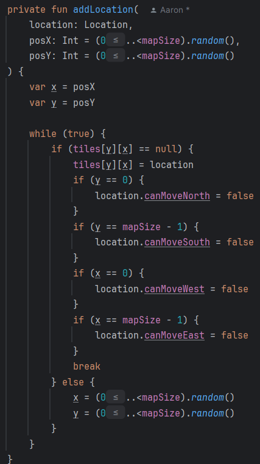
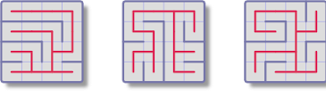
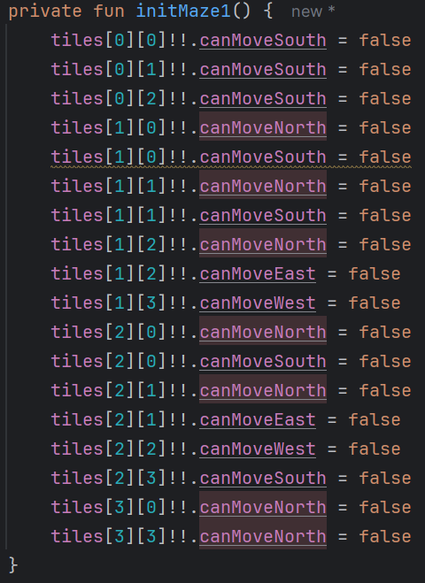
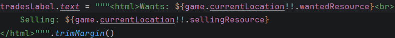
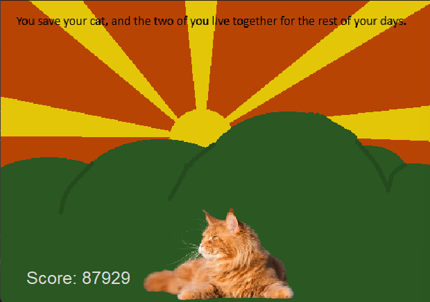
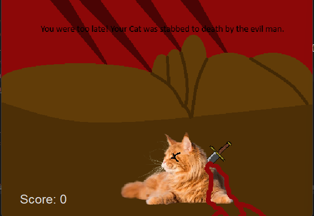

# Development Log

The development log captures key moments in your application development:

- **Design ideas / notes** for features, UI, etc.
- **Key features** completed and working
- **Interesting bugs** and how you overcame them
- **Significant changes** to your design
- Etc.

---

## Date: 25/03/2026

Today I managed to finalise my map generation. Initially I had problems with how the map was generating, as multiple
locations could be put on the same tile of the locations array, so it would never work. However, I refined my generation
function to be much simpler by adding a co-ordinate system for setting up the map. This also meant that I could initialise
the starting square in a similar fashion, and is now much simpler

---

## Date: 19/04/2026

today I decided to implement a maze feature in my game to add a layer of complexity to the map. I picked 3 different
maze designs off the web to implement into my game, shown in this picture: 
I then implemented it using this code: 

---

## Date: 19/04/2026

I fixed the problem where my Inventory window UI seemed to not update. I originally had the window be created in 
the main function, but was updating everything in the mainWindow. I changed it so that it was all being handled in
the MainWindow, and now the UI updates as expected.

---

## Date: 04/05/2026

I was playing around with the UI today, and noticed that on some of the Locations that had a short wantedResource, the trade label would
not wrap in the way I wanted to, as 'Selling:' was on the same line as 'Wanted:...'. To fix this, I made it so that it would always wrap in 
the way I want it to.

---

## Date: 05/05/2026

Today I added a score feature. It works by taking the time when the game starts, and when the timer ends, and subtracting the difference from 
the length of the game timer to give a score. If you lose, the score is 0. 

Win:

Lose:

---

