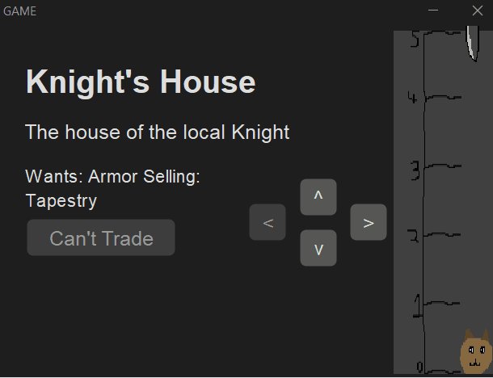
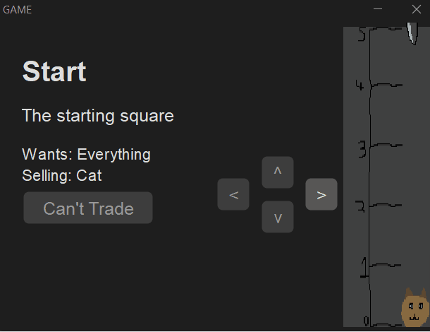

# Results of Testing

The test results show the actual outcome of the testing, following the [Test Plan](test-plan.md)

---

## Moving - VALID

I tested to see if valid moves are possible in my game.

### Test Data To Use

I moved in 3 valid directions, to test if the movement works, as that will give me a good idea of if moving works.

### Test Result

Valid moving worked just how I expected it, all movements took me in the right direction, and every time I pushed a button, I moved.

---

### Moving - BOUNDARY/INVALID

I tested to see how my program handles moving in invalid directions (i.e. outside the map or through a wall) and how if I can move in expected
ways along the boundaries of the map.

### Test Data To Use

I moved along a 3 different boundary squares, and then tried to move out of the map 2 times, and through a maze wall 2 times.

### Test Result

The movement was just as expected. I could move perfectly along the border, but I could not move out of the map, or through a wall

---

